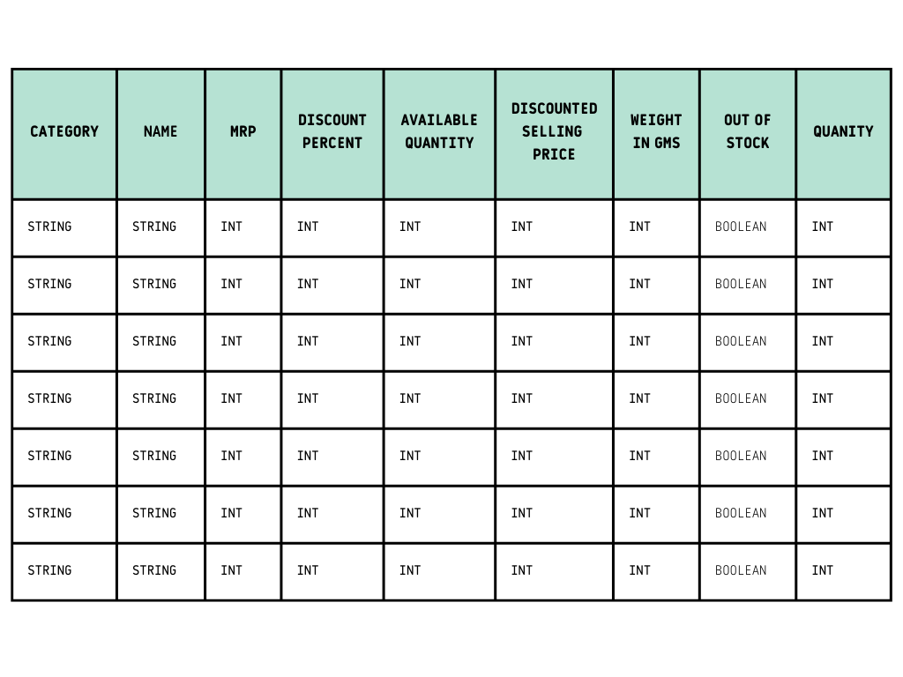

# SQL-BASED BUSINESS INTELLIGENCE ANALYSIS FOR A QUICK COMMERCE PLATFORM

## Project Background

Zepto is a quick-commerce grocery delivery platform operating in the Indian retail and FMCG space, focused on delivering daily essentials within minutes. The company operates on a high-velocity, low-margin business model where pricing strategy, inventory availability, and category performance play a critical role in profitability and customer retention.

From a data analyst’s perspective within Zepto, the primary objective is to leverage product-level data to understand revenue drivers, evaluate discount effectiveness, identify inventory gaps, and support data-driven decision-making across pricing, procurement, and category strategy.

This project analyzes a structured product dataset to simulate real-world business intelligence challenges faced by quick-commerce platforms.
## Scope Of Analysis

Insights and recommendations are provided across the following key areas:

- Category Performance & Revenue Contribution

- Pricing & Discount Effectiveness

- Inventory Availability & Stockout Analysis

- Margin Optimization Opportunities

## Useful Links

- The SQL queries used to inspect and clean the data for this analysis can be found [HERE.](DATACLEANING.ZEPTO.sql)

- Targeted SQL queries addressing specific business questions can be found [HERE.](Dataanalysis.zepto.sql)

- The entire SQL file for the project can be found [HERE.](NEWPROJECT.ZEPTO.sql)

- Dataset can be found [HERE](https://www.kaggle.com/datasets/palvinder2006/zepto-inventory-dataset/data?select=zepto_v2.csv)

## Data Structure 

The primary dataset consists of a single product-level table containing pricing, discount, inventory, and category information, with a total row count of 3728 representing Zepto's active product catalog. 

Initial data checks were conducted to validate data consistency, identify null values, and ensure correct data types before performing analysis.

## Executive Summary

This project analyzes Zepto’s product-level data to evaluate category performance, pricing effectiveness, and inventory availability within a quick-commerce retail context. The analysis identifies cooking essentials and munchies as the primary revenue-driving categories due to consistent, high-frequency demand, while premium high-MRP products demonstrate strong price-inelastic demand even without discounting, highlighting clear margin optimization opportunities. In contrast, fruits and vegetables contribute the least to total revenue despite exhibiting the highest average discount levels, indicating margin erosion driven by perishability rather than demand stimulation. Additionally, recurring stockouts in high-value products reveal gaps in demand forecasting and replenishment prioritization, resulting in missed revenue potential. Overall, the findings support targeted pricing optimization, inventory prioritization for high-impact SKUs, and category-specific discount strategies to improve unit economics and profitability.

## Insights Deep Dive

### **_Category Performance & Revenue Contribution_**

- Cooking essentials and munchies collectively contribute the highest share of total estimated revenue, driven by high purchase frequency and consistent demand.

- These categories show lower revenue volatility, making them critical baseline revenue drivers for the platform.

- Fruits and vegetables contribute the lowest share of total estimated revenue, despite exhibiting the highest average discount percentage across all categories.

- The combination of high discounting and low revenue contribution indicates margin compression without proportional volume uplift.

### **_Pricing & Discount Strategy Analysis_**

- Multiple high-MRP SKUs (above category average MRP) were observed to be out of stock at 0% discount, signaling strong price inelastic demand.

- Premium products demonstrate discount independence, suggesting discounting in these segments may unnecessarily erode gross margins.

- Categories with aggressive discounting do not consistently translate into higher revenue, highlighting diminishing marginal returns on discount spend.

- Discount effectiveness varies significantly by category, reinforcing the need for category-level pricing strategies instead of uniform promotions.

### **_Inventory & Stock Availability Analysis_**

- A disproportionate number of stockouts occur in high-value SKUs, directly impacting potential revenue realization.

- Stockouts in premium products indicate demand forecasting inaccuracies and suboptimal replenishment prioritization.

- Revenue-critical categories experience higher opportunity cost per stockout compared to low-MRP categories.

- Improving fill rates for high-MRP, high-demand SKUs can yield immediate revenue and margin recovery.

### **_Margin Optimization Opportunities_**

- Premium SKUs with stable demand and minimal reliance on discounts present clear gross margin expansion opportunities.

- Reducing discount depth on price-inelastic products can increase contribution margin without impacting demand.

- High-discount, low-revenue categories (e.g., fruits and vegetables) require operational efficiency improvements rather than promotional intensity.

- Strategic alignment of pricing, discounting, and inventory allocation can materially improve unit economics and overall profitability.

## Recommendations

Based on the analysis, the following actions are recommended:

- Prioritize inventory replenishment for high-MRP, high-demand products to prevent revenue loss

- Reduce aggressive discounting in fruits and vegetables and focus on supply-chain efficiency

- Maintain strong stock availability in cooking essentials and munchies to protect core revenue

- Use category-specific discount strategies instead of blanket promotions

- Leverage premium SKUs for margin optimization rather than volume-based discounting
## Assumptions & Caveats

- Revenue and demand are estimated using available pricing and quantity fields due to the absence of transaction-level sales data

- Discount impact is analyzed descriptively and does not account for external demand drivers

- Stock availability is treated as a point-in-time snapshot rather than a time-series trend

- Customer-level behavior is inferred using product-level proxies
## Conclusion

The analysis uncovers clear differences in revenue contribution, pricing sensitivity, and inventory effectiveness across product categories within the quick-commerce platform. 

It identifies cooking essentials and munchies as the primary revenue drivers, while revealing that premium, high-MRP products exhibit strong price-inelastic demand despite zero discounting, presenting clear margin expansion opportunities. 

It also highlights that aggressive discounting in fruits and vegetables leads to margin compression without proportional revenue uplift, indicating inefficient discount spend. Additionally, recurring stockouts in high-value SKUs expose demand forecasting and replenishment gaps that result in direct revenue loss. Collectively, these findings support targeted pricing optimization, inventory prioritization for high-impact SKUs, and category-specific discount strategies to improve overall unit economics and profitability.

# Skills: SQL, MySQL, Business Intelligence, ETL
